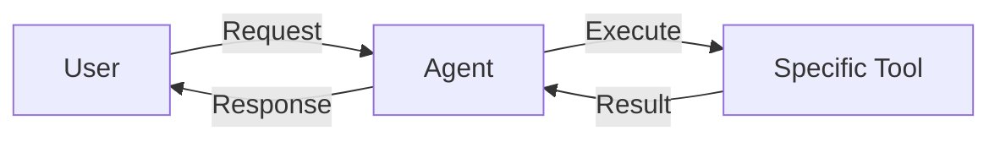
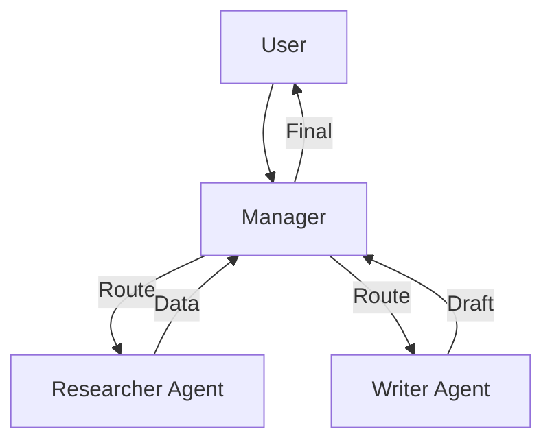
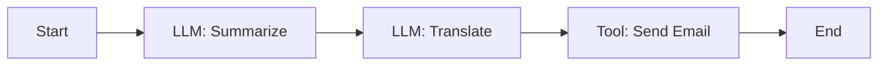
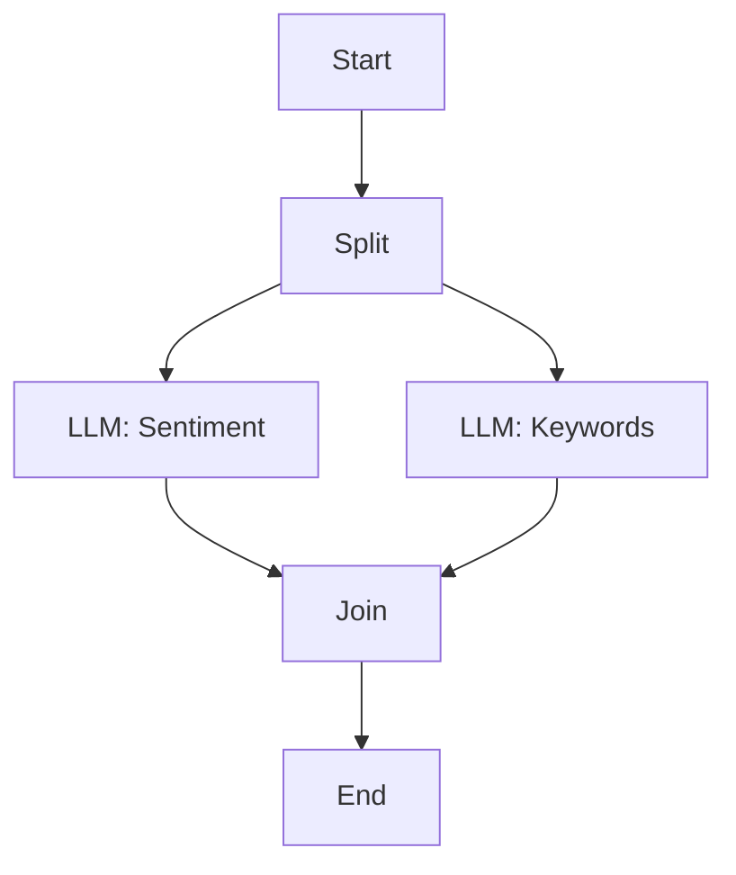
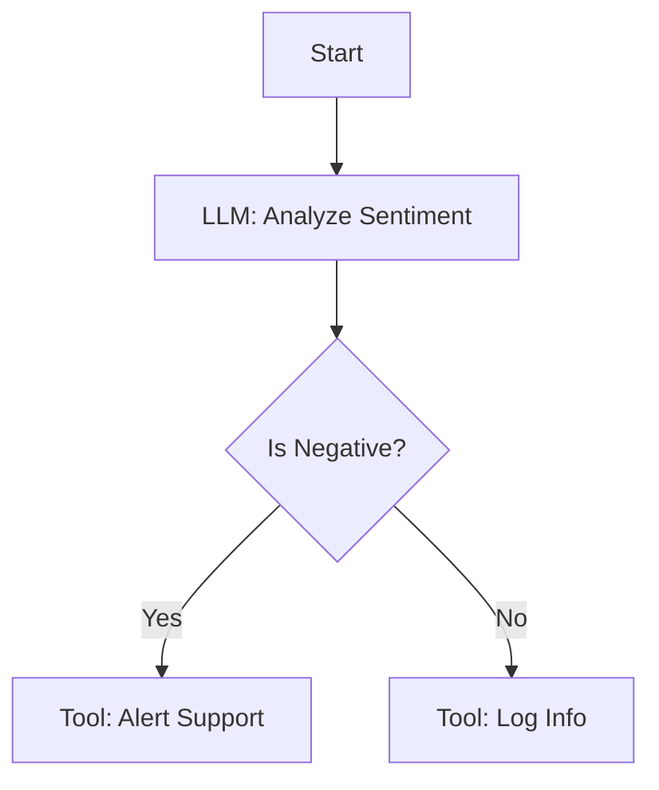

# Comprehensive Agent & Workflow Examples Collection

This guide provides a comprehensive collection of implementation patterns for Agents and Workflows in the system. It covers various agent types, workflow structures, and real-world implementation scenarios.

***

## Table of Contents

1. [Agent Types](#1-agent-types)
   * [Single-Purpose Agent](#single-purpose-agent)
   * [Multi-Agent Coordination](#multi-agent-coordination)
   * [Reactive vs Proactive](#reactive-vs-proactive)
2. [Workflow Examples](#2-workflow-examples)
   * [Sequential Execution](#sequential-execution)
   * [Parallel Processing](#parallel-processing)
   * [Conditional Branching](#conditional-branching)
   * [Human-in-the-Loop](#human-in-the-loop)
3. [Implementation Scenarios](#3-implementation-scenarios)
   * [Data Processing Pipeline](#data-processing-pipeline)
   * [Customer Service Automation](#customer-service-automation)

***

## 1. Agent Types

### Single-Purpose Agent

**Use Case**: A specialized agent designed to perform one specific task extremely well, such as code generation or data formatting.

**Architecture**:



**Configuration (Partial<Agent>)**:

```typescript
{
  name: "SQL Optimizer",
  description: "Analyzes and optimizes SQL queries for performance.",
  icon: { type: "emoji", value: "⚡" },
  instructions: {
    role: "Database Administrator",
    mentions: [{ name: "javascript_execution", type: "defaultTool" }], // Optional if needed
    systemPrompt: `
      You are an expert SQL Database Administrator.
      Your ONLY goal is to take a SQL query provided by the user and return an optimized version.
      - Analyze the query for performance bottlenecks (missing indexes, N+1 issues).
      - Rewrite the query for better efficiency.
      - Explain the changes made.
      Do not answer questions unrelated to SQL optimization.
    `
  }
}
```

**Input/Output**:

* **Input**: `SELECT * FROM users u JOIN orders o ON u.id = o.user_id WHERE u.age > 25`
* **Output**: "Here is the optimized query using specific column selection..."

***

### Multi-Agent Coordination

**Use Case**: A "Router" or "Manager" agent that delegates tasks to specialized sub-agents (represented as tools or via prompts).

**Architecture**:



**Configuration (Manager Agent)**:

```typescript
{
  name: "Content Team Lead",
  description: "Manages research and writing tasks.",
  instructions: {
    role: "Project Manager",
    // In this system, sub-agents are often invoked via specific tools or simply by context switching
    // This example assumes 'research_tool' and 'writing_tool' are available
    mentions: ["research_tool", "writing_tool"],
    systemPrompt: `
      You are a Content Team Lead.
      1. Analyze the user's request.
      2. If research is needed, use the 'research_tool'.
      3. Once research is gathered, use the 'writing_tool' to draft the content.
      4. Review the final output before presenting it to the user.
    `
  }
}
```

***

## 2. Workflow Examples

### Sequential Execution

**Use Case**: A linear process where the output of one step is the input to the next. Example: Summarize -> Translate -> Email.

**Architecture**:



**Configuration (Nodes & Edges)**:

```typescript
const nodes = [
  {
    id: "node-1",
    kind: "llm",
    name: "Summarize",
    nodeConfig: {
      model: { provider: "openai", model: "gpt-4o" },
      prompt: "Summarize the following text: {{input}}"
    }
  },
  {
    id: "node-2",
    kind: "llm",
    name: "Translate",
    nodeConfig: {
      model: { provider: "openai", model: "gpt-4o" },
      prompt: "Translate this summary to Spanish: {{node-1.output}}"
    }
  }
];

const edges = [
  { source: "node-1", target: "node-2" }
];
```

***

### Parallel Processing

**Use Case**: Running multiple independent tasks simultaneously to save time. Example: analyzing text sentiment while simultaneously extracting keywords.

**Architecture**:



**Performance**: Parallel branches execute concurrently. Ensure backend resources (rate limits) can handle simultaneous requests.

***

### Conditional Branching

**Use Case**: Changing the flow based on data criteria. Example: If sentiment is negative, alert support; otherwise, log it.

**Architecture**:



**Configuration (Condition Node)**:

```typescript
{
  id: "node-condition",
  kind: "condition",
  nodeConfig: {
    expressions: [
      {
        key: "{{node-analyze.sentiment}}",
        operator: "equals",
        value: "negative"
      }
    ]
  }
}
// Edges would connect node-condition "true" handle to Alert, "false" to Log.
```

***

## 3. Implementation Scenarios

### Data Processing Pipeline

**Description**: Ingests raw CSV data, cleans it, analyzes it, and generates a report.

**Steps**:

1. **Input**: Receive CSV file content.
2. **Clean**: LLM or Script node to remove malformed rows.
3. **Analyze**: Python/JS execution tool to calculate statistics (mean, median).
4. **Report**: LLM node to write a textual summary of the stats.

**Scaling**: For large datasets (>10MB), use specialized "Batch Processing" nodes or external MCP tools (like the SQLite MCP) instead of passing raw text through LLMs.

***

### Customer Service Automation

**Description**: Handles incoming support tickets.

**Workflow**:

1. **Classify**: Determine intent (Refund, Tech Support, General).
2. **Route (Condition)**:
   * *Refund*: Check eligibility -> Process Refund (Tool) -> Reply.
   * *Tech Support*: Search Knowledge Base (RAG) -> Generate Solution -> Reply.
   * *General*: Auto-reply.
3. **Human Loop**: If confidence is low, route to a "Human Review" node (pauses workflow).

**Human-in-the-loop Config**:
Workflows can include a "Suspend/Wait" state or simply output a "Review Needed" flag that a human operator acts upon in a separate interface.

***

### IT Operations Automation

**Description**: Auto-remediation of server alerts.

**Use Case**:

* Trigger: Webhook from monitoring system (e.g., "Disk Full").
* Step 1: SSH into server (via MCP Tool).
* Step 2: Check logs `tail /var/log/syslog`.
* Step 3: Clean temp files `rm -rf /tmp/*`.
* Step 4: Verify resolution.
* Step 5: Post to Slack.

**Security**: Ensure MCP tools for SSH/Shell have strict permission scoping and audit logging enabled.
